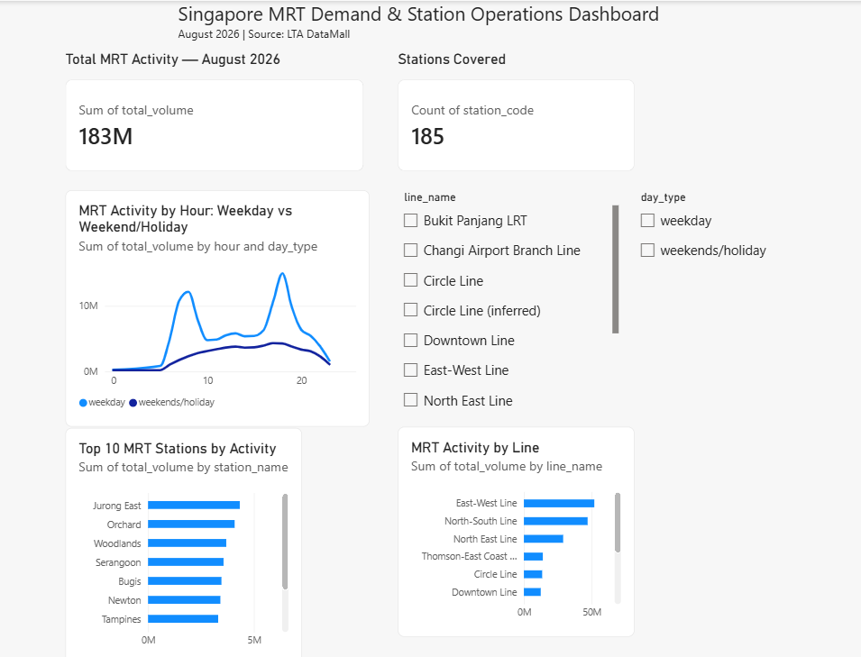
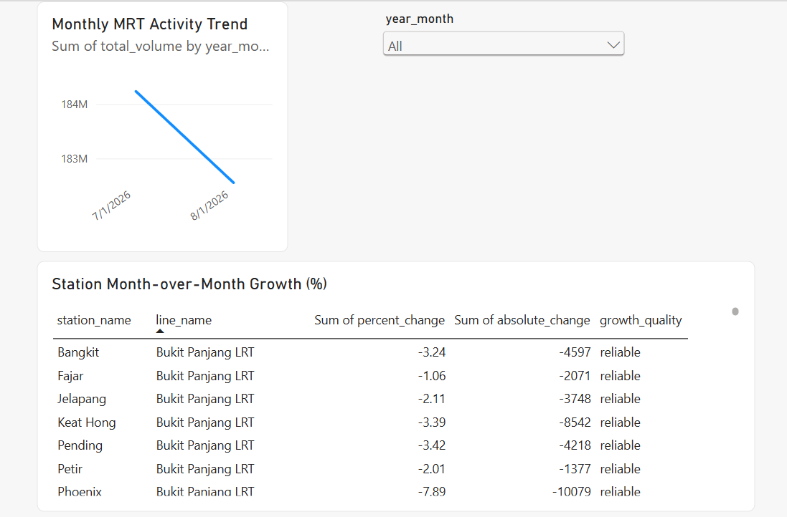

# Singapore MRT Demand & Station Operations Analytics

## Project overview

This project analyzes Singapore MRT station activity using passenger volume data from LTA DataMall. The goal is to identify high-demand stations, peak operating hours, and lines that may require operational attention.

## Business questions

- Which MRT stations have the highest passenger activity?
- What are the busiest hours on weekdays and weekends/holidays?
- Which MRT lines account for the largest share of activity?
- Which stations should be prioritized for operational monitoring?

## Data

- Source: LTA DataMall
- Dataset: Passenger Volume by Train Stations
- Current analysis period: June–August 2026
- Granularity: station, hour, and day type
- Measures: total tap-in volume and total tap-out volume

`total_volume` is defined as:

```text
tap-in volume + tap-out volume
```

It represents station activity, not unique passenger counts.

## Key findings from the current analysis period

- Jurong East recorded the highest total station activity.
- Orchard and Woodlands were also among the highest-activity stations.
- East-West Line recorded the highest total activity among the lines analyzed.
- Weekday activity was substantially higher than weekend/holiday activity.
- Weekday demand showed clear morning and evening peaks, with the strongest peak around 18:00.
- Weekend/holiday activity was concentrated mainly in the afternoon and early evening.

## Dashboard

The Power BI dashboard includes:

- Total MRT activity KPI
- Number of stations covered
- Activity by hour and day type
- Top 10 MRT stations by activity
- Activity by MRT line
- Filters for line and day type

### Dashboard preview

#### August 2026 snapshot



#### Monthly trends



## Interactive web app

The project also includes a Streamlit analytics application. The app recalculates KPIs, peak hour, station rankings, monthly trends, station movement alerts and operational recommendations based on the selected month, MRT line and day type.

The data pipeline includes automated quality checks for required columns, missing station metadata, negative volumes and the total-volume calculation. A GitHub Actions workflow can download the latest available month, rebuild the processed tables and publish the updated outputs.

### Live app

[Open the Singapore MRT Demand Analytics app](https://repository-name-mrt-demand-analytics-kaxxjaulszrvzwrrkdat6s.streamlit.app/)

Run locally:

```powershell
pip install -r requirements.txt
streamlit run app.py
```

The app also supports downloading the currently filtered dataset as a CSV file.

### Automated update workflow

The monthly workflow runs on GitHub Actions and uses an `LTA_ACCOUNT_KEY` repository secret. It downloads the latest available LTA month, combines all tracked monthly files, enriches station metadata, recalculates month-over-month growth and validates the resulting dataset before committing updated outputs.

## Project structure

```text
data/       Raw and processed data
src/        Data download, cleaning, mapping and analysis scripts
outputs/    Summary tables and charts
dashboard/  Power BI dashboard
notebooks/  Exploratory notebooks
sql/        SQL analysis files
```

## Limitations

- The current analysis covers three available months: June–August 2026.
- Activity is measured as combined tap-in and tap-out volume.
- The data does not represent unique passengers.
- A few newer station codes were assigned inferred line labels when they were not available in the older station reference file.

## Future improvements

- Extend the historical window as additional LTA months become available.
- Add anomaly detection and demand forecasting after a longer time series is available.
- Add weather and public holiday analysis.
